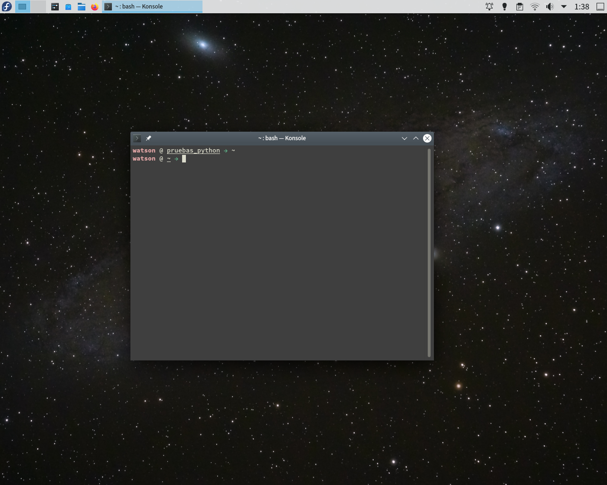

# Umbral's dotfiles

Here are my dotfiles.

I recommend to use `stow` to put the files in the correct
place. It's done like this:

`stow <The directory>`

As always, you should look at what you're doing.
I'm not responsible for any damage that may cause
these files on your machine.

---

I took some code from other people, but it's just
so much that i don't remember. However, i would like
to thank these people for their work.
